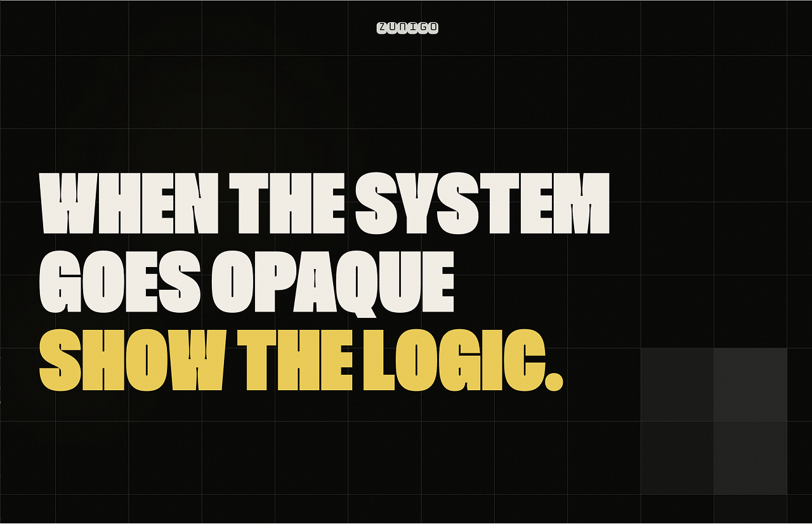

# portfolio-teaser — Lindsay Zuñiga

A static portfolio pitch template. One shared engine, one config file per pitch,
deployed to Netlify with no build step.



> **Reusable as a template.** Click "Use this template" on GitHub, or clone and replace the demo config.

## Quickstart

```bash
# 1. Clone or "Use this template" on GitHub
git clone https://github.com/<you>/<repo>.git portfolio-teaser
cd portfolio-teaser

# 2. Copy the template folder
cp -r template-pitch pitch-acme

# 3. Edit one file — pitch-acme/pitch.config.js
#    See template-pitch/README.md for the full field reference.

# 4. Preview locally
python3 -m http.server 8000
# then open http://localhost:8000/pitch-acme/

# 5. Deploy to Netlify — connect the repo, publish dir = "."
```

No build step. No HTML edits. No script edits.

## Folder structure

```
/
├── shared/                   ← The engine. Used by every pitch.
│   ├── styles.css
│   ├── render.js             ← Hydrates the skeleton from window.PITCH
│   ├── shape-grid.js         ← Reactive square-grid canvas
│   ├── behavior.js           ← Parallax, hScroll, reveals, tweaks panel
│   ├── fonts/                ← (empty — Anton loads via Google Fonts CDN)
│   ├── logo.svg              ← Replace with your own mark
│   └── favicon.png
│
├── template-pitch/           ← Canonical empty pitch — copy this.
│   ├── index.html            ← Skeleton (identical across all pitches)
│   ├── pitch.config.js       ← Blank config with every field documented
│   └── README.md             ← Field-by-field config reference
│
├── demo-shapes/              ← Live demo
│
├── netlify.toml              ← Root deploy config (redirects, cache headers)
├── LICENSE                   ← MIT
└── README.md                 ← (this file)
```

## Deploy

Connect the repo to Netlify with publish dir set to `"."`. The root `netlify.toml` handles:

- Redirect `/ → /demo-shapes/`
- `no-cache` on shared JS and CSS (no manual cache-buster bumps needed)
- Long-cache `immutable` on fonts, images, and SVGs
- Security headers

## Field reference

See **[`template-pitch/README.md`](./template-pitch/README.md)** for the full `pitch.config.js` field reference.

## Typography

The display typeface in the live demo is [**Million**](https://rajputrajesh-448.gumroad.com/l/Million9?layout=profile) by Rajesh Rajput. Million is a licensed typeface — you can purchase it from him directly if you want to use it.

This template ships with **Anton** ([Google Fonts](https://fonts.google.com/specimen/Anton), free under SIL OFL) as the default display typeface so you can fork and use without licensing anything. To swap in your own typeface, update the `--font-display` CSS variable in [`shared/styles.css`](./shared/styles.css) and load your font in the `<link>` tag inside your pitch's `index.html`.

## Credits

- **Square-grid hero** — adapted from the "Squares" component in [React Bits](https://github.com/DavidHDev/react-bits) (MIT)
- Full attribution: [`shared/CREDITS.md`](./shared/CREDITS.md)

## License

MIT. See [LICENSE](./LICENSE).
